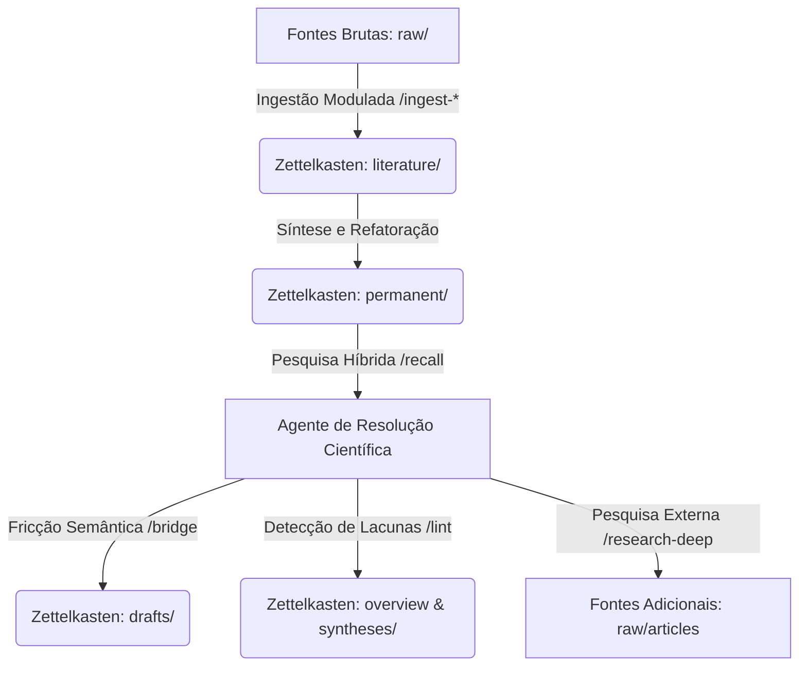

# Manual Oficial de Referência: Skills e Funcionalidades do Agente Zettelkasten

Este manual serve como o guia definitivo para operação, comandos, casos de uso e exemplos práticos de todas as 13 habilidades (*skills*) e motores locais implementados no ecossistema **llm_zettelkasten**.

---

## Estrutura de Diretórios e Fluxo de Informação
O ecossistema é dividido estritamente em dados brutos imutáveis de fontes de pesquisa (`raw/`), notas dinâmicas estruturadas da base de conhecimento (`zettelkasten/`), logs e caches do sistema (`.state/`) e a lógica de software executada via Python (`src/`).



---

## CAPÍTULO 1: Inicialização e Controle de Sessão

### 1.1. Início de Sessão (`/start`)
*   **Arquivo de Regras:** [start.md](.gemini/skills/start.md)
*   **Objetivo:** Restaurar o foco intelectual recente e situar o usuário no início de um ciclo de trabalho.
*   **Caso de Uso:** Executado obrigatoriamente no primeiro prompt de um novo dia ou sessão de pesquisa para absorver os caches ativos.
*   **Gatilho:** `/start` ou `gemini "Inicie a sessão"`
*   **Entradas e Saídas:**
    *   *Lê:* `.state/hot.md`, `.state/log.md` (últimas 5 entradas) e `zettelkasten/overview.md`.
    *   *Gera:* Resumo de situação contínuo na tela em exatamente 3 parágrafos Feynman sem listas.
*   **Exemplo Prático:**
    *   *Input:* `/start`
    *   *Output:*
        > O foco atual da pesquisa está centrado nos modelos preditivos de insolvência utilizando redes generativas adversariais e a modelagem do risco de crédito corporativo. Nas últimas execuções, refinamos as variáveis do sistema regulatório e a similaridade de dados contábeis em cooperativas.
        >
        > As principais decisões tomadas envolveram parametrizar a rede geradora com fatores macroeconômicos de stress e o mapeamento de apêndices financeiros. Ficaram pendentes a validação empírica do rascunho de liquidez no cofre e o download de literatura complementar sobre redes GAN condicionais.
        >
        > Sugere-se realizar a varredura de literatura recente utilizando a pesquisa científica de lacunas ou refatorar a nota permanente de estrutura de capital.

---

### 1.2. Encerramento e Colheita de Sessão (`/close`)
*   **Arquivo de Regras:** [close.md](.gemini/skills/close.md)
*   **Objetivo:** Consolidar descobertas, registrar logs operacionais, atualizar a memória de trabalho e realizar a **Colheita de Sessão (Session Harvesting)** de ideias rascunhadas.
*   **Caso de Uso:** Executado no encerramento de um ciclo de trabalho para congelar o estado.
*   **Gatilho:** `/close` ou `gemini "Encerre a sessão"`
*   **Entradas e Saídas:**
    *   *Lê:* Histórico de chat recente, `.state/log.md` (intervalo ativo) e `.state/hot.md`.
    *   *Grava:* `.state/hot.md` (sobrescrito em 3 parágrafos Feynman), `.state/log.md` (entrada de encerramento) e gera arquivos em `zettelkasten/drafts/` caso identifique novos conceitos não salvos.
*   **Exemplo Prático:**
    *   *Input:* `/close`
    *   *Output (Log final gerado em log.md):*
        ```markdown
        ## [2026-06-06] /close | Sessão encerrada e rascunhos colhidos
        - Criado: zettelkasten/drafts/rascunho-ajuste-risco-liquidez-20260606.md
        - Alterado: .state/hot.md
        ```

---

## CAPÍTULO 2: Ingestão de Literatura

### 2.1. Ingestão de Papers Completos (`/ingest-paper`)
*   **Arquivo de Regras:** [ingest-paper.md](.gemini/skills/ingest-paper.md)
*   **Objetivo:** Extrair a referência ABNT, mapear conceitos estruturados e gerar notas de literatura a partir de PDFs formais densos, com estimativas de custos e tokens antes do processamento.
*   **Caso de Uso:** Processar artigos científicos e relatórios depositados em `raw/papers/` com mais de 10 páginas (com apoio de PageIndex para >20 páginas).
*   **Gatilho:** `/ingest-paper raw/papers/[nome-do-arquivo].pdf` ou `/ingest-paper raw/papers/[nome-do-arquivo].pdf --analyze-only` (ou `-a`).
*   **Requisito de Hash SHA-256 (`document_id`):** O agente calcula o hash binário do PDF via PowerShell no Windows:
    ```powershell
    (Get-FileHash -Algorithm SHA256 -LiteralPath 'raw/papers/nome.pdf').Hash.ToLower()
    ```
    Isso materializa o cache PageIndex em `.pageindex/<document_id>/tree.json` e `manifest.json`.
*   **Melhorias Arquiteturais e de Extração:**
    - **Estimativa Pré-Voo:** Utiliza a ferramenta MCP `estimate_pdf_processing` para calcular páginas, tokens e custos aproximados em USD nos modelos Gemini Flash e Pro antes da ingestão profunda.
    - **Extração com Docling:** Caso o pacote `docling` esteja ativo, utiliza a biblioteca da IBM no parser MCP local para extrair tabelas técnicas e blocos de código com formatação Markdown impecável.
    - **Modularização de Literatura:** Para papers extensos (>30 páginas), divide automaticamente a Nota de Literatura em um índice de literatura mestre e subnotas individuais por capítulo para economizar contexto nas sessões.
    - **Taxonomia de Notas Permanentes:** Orienta a geração em prosa Feynman contínua com foco em quatro eixos: **Frameworks** (modelos aplicáveis), **Princípios de Decisão**, **Técnicas** e **Anti-padrões**.
    - **Modo Apenas Análise (`--analyze-only`):** Gera um relatório estruturado em `zettelkasten/drafts/analise-[document_id].md`, abortando o fluxo antes de poluir as pastas e índices definitivos.
*   **Pausa Obrigatória:** O agente extrai os conceitos e apresenta o resumo, a estimativa de custo pré-voo e a ABNT na tela, pausando e perguntando ao usuário quais conceitos devem virar Notas Permanentes (ou confirmando a gravação do rascunho temporário).
*   **Exemplo Prático de Nota de Literatura Mestre Gerada (`zettelkasten/literature/`):**
    ```yaml
    ---
    type: literature
    id: 202606060730
    title: "Credit Risk Forecasting using Generative Networks"
    authors: [Chen, W., Lee, H.]
    year: 2024
    source_file: raw/papers/chen-2024-credit-risk.pdf
    abnt_reference: "CHEN, W.; LEE, H. Credit Risk Forecasting using Generative Networks. Journal of Banking Finance, v. 12, n. 4, p. 110-128, 2024."
    confidence: high
    ---
    # Credit Risk Forecasting using Generative Networks
    
    A modelagem proposta aborda a instabilidade de previsões contábeis em carteiras de crédito corporativo restritas por meio do treinamento adversarial estruturado. Os autores demonstram que dados sintéticos reduzem o viés de modelos preditivos tradicionais em até catorze por cento.
    ```

---

### 2.2. Triagem Rápida de Introdução (`/ingest-paper-intro`)
*   **Arquivo de Regras:** [ingest-paper-intro.md](.gemini/skills/ingest-paper-intro.md)
*   **Objetivo:** Fazer leitura parcial (Abstract e Introdução) de papers longos para decidir se merecem leitura completa ou rejeição.
*   **Caso de Uso:** Triar rapidamente PDFs recém-baixados sem incorrer em altos custos de tokens de contexto.
*   **Gatilho:** `/ingest-paper-intro raw/papers/[nome-do-arquivo].pdf`
*   **Exemplo Prático:**
    *   *Input:* `/ingest-paper-intro raw/papers/relatorio-risco-basileia.pdf`
    *   *Output:* Apresenta o abstract traduzido e propõe se o documento deve ser indexado integralmente ou arquivado.

---

### 2.3. Ingestão de Artigos Informais (`/ingest-article`)
*   **Arquivo de Regras:** [ingest-article.md](.gemini/skills/ingest-article.md)
*   **Objetivo:** Ingerir recortes, posts de blog, artigos de wiki ou notícias salvos em formato Markdown.
*   **Caso de Uso:** Processar fontes informais que não possuem estrutura de paper acadêmico, mapeando a URL e a procedência.
*   **Gatilho:** `/ingest-article raw/articles/[nome-do-artigo].md`
*   **Exemplo Prático (YAML da Literatura Gerada):**
    ```yaml
    ---
    type: literature
    source_kind: web_article
    id: 202606060732
    title: "Understanding PEARLS Ratios in Credit Unions"
    authors: [World Council of Credit Unions]
    year: 2023
    source_file: raw/articles/pearls-guide.md
    url: "https://www.woccu.org/pearls"
    retrieved_at: "2026-06-06"
    abnt_reference: "WORLD COUNCIL OF CREDIT UNIONS. Understanding PEARLS Ratios. WOCCU Technical Guide, 2023."
    confidence: medium
    ---
    ```

---

### 2.4. Ingestão de Transcrições de Vídeo (`/ingest-youtube`)
*   **Arquivo de Regras:** [ingest-youtube.md](.gemini/skills/ingest-youtube.md)
*   **Objetivo:** Ingerir arquivos contendo transcrições estruturadas geradas pelo pipeline autônomo do YouTube.
*   **Caso de Uso:** Extrair conhecimento científico compartilhado em palestras, vídeo-aulas ou seminários corporativos de finanças.
*   **Gatilho:** `/ingest-youtube raw/articles/[nome-do-video].md`
*   **Frontmatter Padrão:** O YAML gerado deve mapear `source_kind: youtube_transcript` e incluir o `video_id`. No corpo do texto, o agente é instruído a explicitar o risco inerente da oralidade da fonte.

---

### Pipeline de Ingestão Autônoma (YouTube ETL)
*   **Script do Sistema:** [youtube_etl.py](src/ingestion/youtube_etl.py)
*   **Funcionamento:** Um script Python executado em background que lê um feed RSS XML de uma playlist do YouTube configurada no `.env`, baixa e extrai legendas via `youtube-transcript-api` de novos vídeos e gera arquivos brutos em `raw/articles/`, registrando-os no histórico para evitar duplicações.

---

## CAPÍTULO 3: Recuperação e Rastreamento

### 3.1. Busca Híbrida e Semântica (`/recall`)
*   **Arquivo de Regras:** [recall.md](.gemini/skills/recall.md)
*   **Objetivo:** Recuperar notas e trechos da base unindo termos de busca exatos e similaridade semântica local.
*   **Caso de Uso:** Recuperar informações teóricas antes de propor novas conexões ou rascunhos.
*   **Gatilho:** `/recall [termo-de-busca]`
*   **Funcionamento Interno:** Aciona as ferramentas MCP `search_zettelkasten` and `semantic_search_zettelkasten` (via endpoint local Ollama com `nomic-embed-text` ou fallback offline por hashing normalizado).

---

### 3.2. Rastreio Teórico de Conceitos (`/trace`)
*   **Arquivo de Regras:** [trace.md](.gemini/skills/trace.md)
*   **Objetivo:** Reconstruir a evolução cronológica ou causal de um conceito ou variável na base de dados.
*   **Caso de Uso:** Mapear de forma linear como a literatura tratou a variável *insolvência* ao longo dos anos.
*   **Gatilho:** `/trace [conceito/variável]`
*   **Saída:** Um relatório dissertativo contínuo (prosa de 3 parágrafos Feynman) listando o avanço cronológico e as notas cruzadas.

---

## CAPÍTULO 4: Fricção Criativa e Pesquisa de Impacto

### 4.1. Atrito Criativo Semântico (`/bridge`)
*   **Arquivo de Regras:** [bridge.md](.gemini/skills/bridge.md)
*   **Objetivo:** Sortear e cruzar duas notas conceitualmente distantes da base em prosa dissertativa de dois parágrafos para propor modelagens híbridas.
*   **Caso de Uso:** Forçar a interdisciplinaridade para gerar novos rascunhos conceituais originais.
*   **Gatilho:** `/bridge`
*   **Exemplo Prático (Rascunho Ponte Semântica Gerado):**
    ```yaml
    ---
    type: draft
    id: 202606060715
    title: "Ponte Semântica: Indicadores PEARLS e Redes GAN"
    references: [[pearls-cooperativas-credito]], [[redes-neurais-gan-insolvencia]]
    ---
    # Ponte Semântica: Indicadores PEARLS e Redes GAN

    O atrito criativo entre o sistema de monitoramento **PEARLS**, voltado para a saúde de cooperativas de crédito, e as **redes generativas adversariais (GANs)** reside na distância entre uma métrica estática regulatória e um algoritmo de simulação probabilística profunda. Enquanto os indicadores contábeis tradicionais revelam fragilidades retroativas de solvência, a rede neural busca mapear e forçar cenários simulados sintéticos de estresse macroeconômico a partir de amostras de dados escassas de balanços históricos.

    A tangência conceitual unificadora ocorre na utilização de redes geradoras para sintetizar balanços sintéticos plausíveis que apresentem anomalias extremas nos índices de estrutura de capital e liquidez do PEARLS. Desta forma, a rede adversária atua como um simulador de cenários de estresse de liquidez extrema (PEARLS Liquidez), gerando dados artificiais para testar a resiliência contábil de cooperativas antes que crises reais de liquidez se materializem no mercado financeiro.
    ```

---

### 4.2. Pesquisa Acadêmica Baseada em Lacunas (`/research-deep`)
*   **Arquivo de Regras:** [research-deep.md](.gemini/skills/research-deep.md)
*   **Objetivo:** Identificar lacunas de pesquisa locais e buscar em bases científicas online (OpenAlex, arXiv) abstracts relevantes para orientar novas aquisições de PDF.
*   **Caso de Uso:** Preencher as lacunas descritas pelo `/lint` ou especificadas pelo usuário.
*   **Gatilho:** `/research-deep [termo-especifico]`
*   **Exemplo Prático:** Salva um relatório estruturado de 3 parágrafos Feynman em `raw/articles/pesquisa-profunda-...md` apontando 3 artigos de relevância e recomendando qual deles baixar.

---

## CAPÍTULO 5: Consolidação, Auditoria e Saúde do Cofre

### 5.1. Auditoria e Saúde do Zettelkasten (`/lint`)
*   **Arquivo de Regras:** [lint.md](.gemini/skills/lint.md)
*   **Objetivo:** Auditar a integridade das notas, encontrar links mortos, notas órfãs, e **regenerar a síntese viva** em [overview.md](zettelkasten/overview.md).
*   **Caso de Uso:** Executar periodicamente para auditar a qualidade técnica da base e documentar anomalias.
*   **Gatilho:** `/lint zettelkasten/`
*   **Saídas:**
    *   Regenera o arquivo [overview.md](zettelkasten/overview.md).
    *   Adiciona o link semântico no [index.md](zettelkasten/index.md).
    *   Gera um relatório descritivo contínuo de 3 parágrafos Feynman em `zettelkasten/syntheses/relatorio-manutencao-[data].md`.

---

### 5.2. Redação Acadêmica de Sínteses (`/ghost`)
*   **Arquivo de Regras:** [ghost.md](.gemini/skills/ghost.md)
*   **Objetivo:** Redigir rascunhos de sínteses complexas, ensaios ou capítulos de livros baseando-se em múltiplas notas existentes no cofre.
*   **Caso de Uso:** Escrever seções teóricas estruturadas de trabalhos científicos cruzando a literatura e as notas permanentes catalogadas.
*   **Gatilho:** `/ghost [tema/lista-de-notas]`
*   **Saída:** Salva um rascunho dissertativo robusto na pasta `zettelkasten/drafts/` e o vincula ao índice.

---

## CAPÍTULO 6: Apresentação e Visualização

### 6.1. Visualização e Slides (`/visual`)
*   **Arquivo de Regras:** [visual.md](.gemini/skills/visual.md)
*   **Objetivo:** Gerar diagramas conceituais estruturados em Mermaid ou criar slides acadêmicos em formato Marp Markdown.
*   **Caso de Uso:** Apresentar graficamente conexões de variáveis contábeis ou estruturas de modelos estatísticos.
*   **Gatilho:** `/visual [conceito-a-explicar]`
*   **Exemplo Prático (Slide Marp Gerado em zettelkasten/presentations/):**
    ```markdown
    ---
    marp: true
    theme: default
    class: lead
    ---
    # Previsão de Insolvência Cooperativa
    ---
    ## Desafio Contábil
    - Baixo volume amostral de falências.
    - Indicadores PEARLS estáticos.
    ---
    ## Solução Adversarial
    - Utilização de Redes GAN para dados sintéticos.
    - Testes de stress simulados.
    ```

---

## CAPÍTULO 7: Diretrizes Normativas e Protocolos

### 7.1. Protocolo de Reconciliação e Auto-Refatoração
*   **Diretriz Normativa:** [GEMINI.md](GEMINI.md) (Seção 2)
*   **Regra de Ouro:** Antes de criar qualquer nova nota permanente, o agente **deve** pesquisar a base (lexical e semântica). Se já houver nota tratando do conceito, o agente deve **acrescentar** as informações na nota permanente antiga, atualizando o frontmatter com as novas referências. Duplicações conceituais são proibidas.

### 7.2. Regras de Escrita e Estilo Feynman
Toda e qualquer nota criada ou alterada na pasta `zettelkasten/` (literature, permanent, drafts, syntheses) deve obedecer aos seguintes critérios:
*   **Escrita em Prosa Contínua:** Listas de marcadores (bullet points) são proibidas no corpo das notas (o arquivo `zettelkasten/index.md` é a única exceção).
*   **Técnica Feynman:** Desconstruir complexidades matemáticas e conceituais de forma simples e precisa.
*   **Sem Rótulos de Seção:** É proibido iniciar parágrafos com títulos textuais informais (ex: "Introdução.", "Desenvolvimento.").
*   **Destaque Restrito:** **Negrito** deve ser usado estritamente para constructos, nomes de variáveis e algoritmos centrais.
*   **Sem Travessões:** Explicações devem ser intercaladas por vírgulas ou períodos curtos e objetivos.
*   **Sem Emojis ou Elementos Visuais Informais.**
