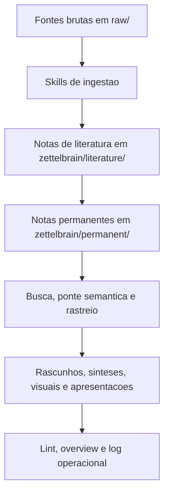

# Manual de Funcionalidades e Skills

Este manual descreve os workflows operacionais disponiveis em `skills/` e os motores Python implementados em `src/`.

## Fluxo geral

## Skills de sessao

### `/start`

- Regras: [../skills/start.md](../skills/start.md)
- Le: `.state/hot.md`, `.state/log.md` e `zettelbrain/overview.md`.
- Nao escreve no log.
- Objetivo: restaurar contexto recente e sugerir proximo foco de trabalho.

### `/close`

- Regras: [../skills/close.md](../skills/close.md)
- Atualiza `.state/hot.md` e `.state/log.md`.
- Pode colher ideias de chat em `zettelbrain/drafts/`.
- Objetivo: encerrar sessao com estado recuperavel.

## Skills de ingestao

### `/ingest-paper`

- Regras: [../skills/ingest-paper.md](../skills/ingest-paper.md)
- Entrada: PDFs ou documentos formais em `raw/papers/`.
- Usa `document_id` SHA-256 do binario completo.
- Pode usar cache PageIndex em `.pageindex/<document_id>/`.
- Gera nota de literatura e, apos validacao humana, notas permanentes.
- Ferramentas MCP relacionadas: `resolve_pdf`, `compute_pdf_sha256`, `estimate_pdf_processing`, `index_pdf_cache`, `read_pdf_cache`, `read_pdf_page`.

### `/ingest-paper-intro`

- Regras: [../skills/ingest-paper-intro.md](../skills/ingest-paper-intro.md)
- Entrada: documento formal em `raw/papers/`.
- Objetivo: triagem rapida de resumo e introducao antes de leitura completa.

### `/ingest-article`

- Regras: [../skills/ingest-article.md](../skills/ingest-article.md)
- Entrada: Markdown em `raw/articles/`.
- Trata fontes informais da web com rastreabilidade, URL, data de recuperacao e avaliacao de procedencia.
- `confidence` e obrigatorio na nota de literatura.

### `/ingest-youtube`

- Regras: [../skills/ingest-youtube.md](../skills/ingest-youtube.md)
- Entrada: Markdown em `raw/youtube/` com `source_kind: youtube_transcript`.
- Trata oralidade, erro de transcricao e necessidade de checagem em fontes primarias.
- `confidence` e obrigatorio.

## Skills de recuperacao e analise

### `/recall`

- Regras: [../skills/recall.md](../skills/recall.md)
- Usa busca hibrida por `search_zettelbrain`.
- Combina `qmd` quando disponivel, BM25 local e resultados semanticos.
- Pode usar cache PageIndex quando a fonte relevante for PDF.

### `/trace`

- Regras: [../skills/trace.md](../skills/trace.md)
- Reconstrui a evolucao cronologica ou causal de um conceito.
- Gera sinteses em `zettelbrain/syntheses/` quando aplicavel.

### `/bridge`

- Regras: [../skills/bridge.md](../skills/bridge.md)
- Usa `get_semantic_bridge` quando o indice de embeddings existe.
- Cruza notas conceitualmente distantes para criar friccao criativa e novos rascunhos.

### `/research-deep`

- Regras: [../skills/research-deep.md](../skills/research-deep.md)
- Pesquisa lacunas externas e salva relatorios brutos em `raw/articles/`.
- Os relatorios devem passar por `/ingest-article` antes de entrar no cofre.

## Skills de producao e manutencao

### `/ghost`

- Regras: [../skills/ghost.md](../skills/ghost.md)
- Redige rascunhos academicos e sinteses complexas com base em notas existentes.
- Grava em `zettelbrain/drafts/`.

### `/visual`

- Regras: [../skills/visual.md](../skills/visual.md)
- Cria diagramas Mermaid, descricoes tecnicas de imagens e slides Marp.
- Usa `zettelbrain/visual/` e `zettelbrain/presentations/`.

### `/lint`

- Regras: [../skills/lint.md](../skills/lint.md)
- Aciona o linter Python `zettelbrain_lint.py` via CLI ou ferramenta MCP.
- Verifica links mortos, notas orfas, conexao minima, referencias a notas deprecadas e padroes emergentes.
- Pode atualizar `zettelbrain/overview.md` e gerar relatorios em `zettelbrain/syntheses/`.

## Motores locais

### Setup de clientes

- Codigo: [../src/setup.py](../src/setup.py)
- CLI: `uv run install bootstrap`, `uv run install gemini`, `uv run install cursor`, `uv run install clean`.
- `bootstrap` ou `local`: cria a estrutura ignorada pelo Git para `raw/`, `zettelbrain/`, `logs/`, `.state/` e `.pageindex/`.
- `gemini`: cria `.gemini/settings.json` e sincroniza `skills/`.
- `cursor`: cria `.cursor/mcp.json` e compila [ZETTELBRAIN.md](../ZETTELBRAIN.md) com `skills/`.
- `clean`: remove configuracoes locais geradas.

### ETL de artigos web

- Codigo: [../src/ingestion/article_etl.py](../src/ingestion/article_etl.py)
- CLI: `uv run zb-article-etl --url "<URL>"`
- Saida: Markdown limpo em `raw/articles/` com frontmatter.
- Em falha final de acesso, registra JSONL em `logs/article_access_errors.jsonl`.

### ETL de YouTube

- Codigo: [../src/ingestion/youtube_etl.py](../src/ingestion/youtube_etl.py)
- CLI: `uv run zb-youtube-etl --limit 5` ou `uv run zb-youtube-etl --dry-run`.
- Entrada: playlist configurada por `YOUTUBE_PLAYLIST_ID`.
- Saida: Markdown em `raw/youtube/` e historico em `.state/historico_ingestao.txt`.

### Servidor MCP

- Codigo: [../src/mcp/server.py](../src/mcp/server.py)
- Health check: `uv run python src/mcp/server.py --health-json`
- Execucao: `uv run zettelbrain-mcp` ou `uv run zb-mcp`.
- Ferramentas detalhadas em [mcp-tools.md](mcp-tools.md).

### Linter

- Codigo: [../src/zettelbrain_lint.py](../src/zettelbrain_lint.py)
- CLI: `uv run zettelbrain-lint` ou `uv run zb-lint`.
- JSON: `uv run zettelbrain-lint --json`.
